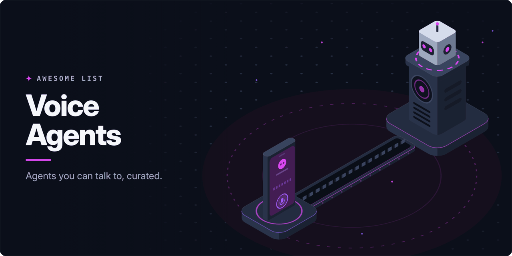

<!-- awesome:hero --><!-- /awesome:hero -->

<!-- awesome:title --><h1 align="center">Awesome Voice Agents</h1><!-- /awesome:title -->

<!-- awesome:tagline -->Frameworks, realtime speech APIs, speech models and hosted platforms for AI agents that talk and listen.<!-- /awesome:tagline -->

<!-- awesome:badges -->

  
  
  

<!-- /awesome:badges -->

A voice agent is an AI agent you talk to: it listens, decides what to do, and answers out loud, often over a phone line or a browser call. This list covers the frameworks, hosted platforms, realtime speech APIs, speech models, turn-taking tools, transport and testing tools used to build one.

## Contents

- [Frameworks](#frameworks)
  - [Agent frameworks](#agent-frameworks)
  - [Self-hosted platforms](#self-hosted-platforms)
  - [Assistants and devices](#assistants-and-devices)
- [Hosted platforms](#hosted-platforms)
- [Realtime speech APIs](#realtime-speech-apis)
- [Speech-to-speech models](#speech-to-speech-models)
- [Speech recognition](#speech-recognition)
  - [Open-source recognition](#open-source-recognition)
  - [Recognition APIs](#recognition-apis)
- [Speech synthesis](#speech-synthesis)
  - [Open-source synthesis](#open-source-synthesis)
  - [Synthesis APIs](#synthesis-apis)
- [Turn-taking and audio](#turn-taking-and-audio)
- [Transport and telephony](#transport-and-telephony)
  - [Transport](#transport)
  - [Telephony](#telephony)
  - [Client SDKs and UI](#client-sdks-and-ui)
- [Testing and evaluation](#testing-and-evaluation)
- [Guides and examples](#guides-and-examples)
  - [Starters and examples](#starters-and-examples)
  - [Reading](#reading)
- [Contributing](#contributing)

## Frameworks

### Agent frameworks

- [Gabber](https://github.com/gabber-dev/gabber) - Graph-based engine for realtime AI apps that hear, see and speak, with many participants.
- [Hugging Face speech-to-speech](https://github.com/huggingface/speech-to-speech) - Cascaded voice agent pipeline built from open VAD, speech, language and voice models.
- [LiveKit Agents](https://github.com/livekit/agents) - Python framework for realtime voice agents over WebRTC, with built-in turn detection.
- [LiveKit Agents JS](https://github.com/livekit/agents-js) - Node.js version of LiveKit Agents for realtime voice and multimodal agents.
- [OpenAI Agents SDK](https://github.com/openai/openai-agents-python) - Python agent framework with a voice pipeline and realtime agents on the Realtime API.
- [OpenAI Agents SDK for TypeScript](https://github.com/openai/openai-agents-js) - TypeScript agent framework that runs realtime voice agents in the browser or on a server.
- [Patter](https://github.com/PatterAI/Patter) - Open-source SDK that gives an AI agent a phone number for inbound and outbound calls.
- [Pipecat](https://github.com/pipecat-ai/pipecat) - Python framework that chains speech, LLM and voice services into realtime voice agent pipelines.
- [Qwen Audio Agent](https://github.com/QwenAudio/qwen-audio-agent) - Realtime voice runtime that keeps an agent talking while it calls tools or works on tasks.
- [TEN Framework](https://github.com/TEN-framework/ten-framework) - Framework for realtime conversational voice agents, with extensions and a visual designer.
- [Unmute](https://github.com/kyutai-labs/unmute) - Kyutai system that wraps any text LLM with low-latency streaming speech in and out.
- [Vision Agents](https://github.com/GetStream/Vision-Agents) - Framework from Stream for low-latency voice and video agents with pluggable models.

### Self-hosted platforms

- [Bolna](https://github.com/bolna-ai/bolna) - Open-source platform that builds phone voice agents from a JSON config.
- [Call Center AI](https://github.com/microsoft/call-center-ai) - Microsoft sample that places and answers phone calls with an AI agent on Azure.
- [Dograh](https://github.com/dograh-hq/dograh) - Self-hosted voice agent platform with a visual workflow builder, an open alternative to Vapi.
- [Rapida](https://github.com/rapidaai/voice-ai) - Open-source voice AI orchestration platform for building and running voice agents.

### Assistants and devices

- [ElatoAI](https://github.com/akdeb/ElatoAI) - Realtime voice AI on ESP32 boards over secure WebSockets, for companions and toys.
- [GLaDOS](https://github.com/dnhkng/GLaDOS) - Local voice assistant with low-latency speech in and out, voiced as the Portal character.
- [VoiceMode](https://github.com/mbailey/voicemode) - MCP server that lets Claude Code and other agents hold spoken conversations.
- [xiaozhi-esp32](https://github.com/78/xiaozhi-esp32) - ESP32 firmware for a voice chatbot device that controls tools and devices through MCP.
- [xiaozhi-esp32-server](https://github.com/xinnan-tech/xiaozhi-esp32-server) - Self-hosted backend that runs speech, LLM and MCP tools for xiaozhi-esp32 devices.

## Hosted platforms

- [Bland AI](https://www.bland.ai) - Enterprise platform for building and running phone call agents.
- [Cartesia Line](https://cartesia.ai/line) - Managed voice agent platform from Cartesia with a code-first Python SDK.
- [ElevenLabs Agents](https://elevenlabs.io/agents) - ElevenLabs platform for voice and chat agents with tools, telephony and testing.
- [LiveKit Cloud](https://livekit.io/cloud) - Managed hosting, telephony and observability for LiveKit voice agents.
- [Millis AI](https://www.millis.ai) - Platform for building low-latency voice agents for the web and the phone.
- [Pipecat Cloud](https://www.daily.co/products/pipecat-cloud/) - Daily's managed hosting for deploying and scaling Pipecat voice agents.
- [PolyAI](https://poly.ai) - Enterprise voice agents that answer customer service phone lines.
- [Retell AI](https://www.retellai.com) - Platform for building, testing and deploying phone voice agents.
- [Synthflow](https://synthflow.ai) - No-code platform for voice agents that answer and place phone calls.
- [Telnyx Voice AI Agents](https://telnyx.com/products/voice-ai-agents) - Voice agents that run on Telnyx's own telephony network and inference.
- [Vapi](https://vapi.ai) - Developer platform for voice agents with pluggable speech, model and telephony providers.
- [Voiceflow](https://www.voiceflow.com) - Platform for designing and running voice and chat agents for customer support.

## Realtime speech APIs

- [Agora Conversational AI Engine](https://www.agora.io/en/products/conversational-ai-engine/) - Agora service that joins a voice agent built on any LLM to a realtime channel.
- [Amazon Nova Sonic](https://aws.amazon.com/ai/generative-ai/nova/speech/) - AWS speech-to-speech model for realtime voice conversations through Bedrock.
- [Azure Voice Live API](https://learn.microsoft.com/en-us/azure/ai-services/speech-service/voice-live) - Azure API for low-latency speech-to-speech agents with noise suppression and avatars.
- [Deepgram Voice Agent API](https://deepgram.com/product/voice-agent-api) - One API that runs speech recognition, an LLM and speech output for a voice agent.
- [Gemini Live API](https://ai.google.dev/gemini-api/docs/live) - Google API for low-latency, two-way voice and video sessions with Gemini.
- [Grok Voice Agent API](https://docs.x.ai/docs/guides/voice) - xAI API for realtime speech-to-speech agents on Grok.
- [Hume EVI](https://www.hume.ai/empathic-voice-interface) - Speech-to-speech API that reads and responds to the emotion in the user's voice.
- [OpenAI Realtime API](https://platform.openai.com/docs/guides/realtime) - API for low-latency speech-to-speech sessions over WebRTC, WebSocket or SIP.
- [Ultravox Realtime](https://docs.ultravox.ai) - Hosted voice agent API built on the speech-native Ultravox model.

## Speech-to-speech models

- [Fun-Audio-Chat](https://github.com/QwenAudio/Fun-Audio-Chat) - Large audio language model built for natural, low-latency voice conversation.
- [LFM2-Audio](https://github.com/Liquid4All/liquid-audio) - Liquid AI's small end-to-end speech-to-speech model built for low latency.
- [MiniCPM-o](https://github.com/OpenBMB/MiniCPM-V) - Small omni model that sees, listens and speaks, with full-duplex live streaming.
- [Moshi](https://github.com/kyutai-labs/moshi) - Full-duplex speech-text model from Kyutai that listens and speaks at the same time.
- [PersonaPlex](https://github.com/NVIDIA/personaplex) - NVIDIA full-duplex speech model with persona control by text prompt and voice sample.
- [Qwen3-Omni](https://github.com/QwenLM/Qwen3-Omni) - Alibaba omni model that takes text, audio, images and video and answers in streaming speech.
- [Step-Audio 2](https://github.com/stepfun-ai/Step-Audio2) - End-to-end audio language model for speech understanding and spoken conversation.
- [Ultravox](https://github.com/fixie-ai/ultravox) - Open multimodal LLM that takes speech directly, with no separate recognition step.

## Speech recognition

### Open-source recognition

- [faster-whisper](https://github.com/SYSTRAN/faster-whisper) - Whisper reimplemented on CTranslate2 for faster, lighter transcription.
- [FunASR](https://github.com/modelscope/FunASR) - Speech recognition toolkit with streaming ASR, VAD and punctuation models.
- [Kyutai DSM](https://github.com/kyutai-labs/delayed-streams-modeling) - Kyutai streaming speech-to-text and text-to-speech models, the ones Unmute runs on.
- [Moonshine](https://github.com/moonshine-ai/moonshine) - Very low-latency on-device speech recognition models for voice interfaces.
- [NeMo Speech](https://github.com/NVIDIA-NeMo/Speech) - NVIDIA toolkit behind the Parakeet and Canary speech recognition models.
- [RealtimeSTT](https://github.com/KoljaB/RealtimeSTT) - Python library for low-latency speech-to-text with VAD and wake word activation.
- [SenseVoice](https://github.com/QwenAudio/SenseVoice) - Fast multilingual speech recognition model that also tags emotion and audio events.
- [sherpa-onnx](https://github.com/k2-fsa/sherpa-onnx) - Offline speech recognition, synthesis and VAD on ONNX for servers, phones and boards.
- [Speaches](https://github.com/speaches-ai/speaches) - OpenAI-compatible server for streaming transcription and speech generation.
- [whisper.cpp](https://github.com/ggml-org/whisper.cpp) - Whisper in plain C and C++ for fast local transcription on CPU and GPU.
- [WhisperKit](https://github.com/argmaxinc/argmax-oss-swift) - On-device speech recognition for Apple Silicon, in Swift.
- [WhisperLive](https://github.com/collabora/WhisperLive) - Near-live Whisper transcription server with WebSocket clients.
- [WhisperLiveKit](https://github.com/QuentinFuxa/WhisperLiveKit) - Local realtime speech-to-text server with streaming ASR and speaker diarization.

### Recognition APIs

- [AssemblyAI Universal-Streaming](https://www.assemblyai.com/products/streaming-speech-to-text) - Streaming speech-to-text API with turn detection tuned for voice agents.
- [Deepgram Flux](https://deepgram.com/flux) - Conversational speech recognition model with built-in end-of-turn detection.
- [Deepgram Speech-to-Text](https://deepgram.com/product/speech-to-text) - Low-latency streaming transcription API.
- [ElevenLabs Speech to Text](https://elevenlabs.io/speech-to-text) - ElevenLabs Scribe transcription API, with a realtime model for agents.
- [Gladia](https://www.gladia.io) - Realtime and batch transcription API for voice products.
- [Mistral Voxtral](https://docs.mistral.ai/capabilities/audio/) - Mistral open-weight speech models and API for transcription and audio understanding.
- [OpenAI Speech to Text](https://platform.openai.com/docs/guides/speech-to-text) - OpenAI transcription API with streaming output.
- [Soniox](https://soniox.com) - Multilingual realtime speech-to-text and translation API.
- [Speechmatics](https://www.speechmatics.com) - Realtime speech recognition API in many languages, with a version for voice agents.

## Speech synthesis

### Open-source synthesis

- [Chatterbox](https://github.com/resemble-ai/chatterbox) - Resemble AI's open TTS models with voice cloning and emotion control.
- [CosyVoice](https://github.com/QwenAudio/CosyVoice) - Multilingual TTS with text-in and audio-out streaming at low latency.
- [Dia](https://github.com/nari-labs/dia) - TTS model that generates two-speaker dialogue with nonverbal sounds in one pass.
- [Fish Speech](https://github.com/fishaudio/fish-speech) - Open multilingual TTS with zero-shot voice cloning.
- [KittenTTS](https://github.com/KittenML/KittenTTS) - Tiny open TTS model that runs on a CPU.
- [Kokoro-FastAPI](https://github.com/remsky/Kokoro-FastAPI) - Docker server for the Kokoro-82M TTS model behind an OpenAI-compatible API.
- [NeuTTS](https://github.com/neuphonic/neutts) - Neuphonic's on-device TTS models with instant voice cloning.
- [Orpheus TTS](https://github.com/canopyai/Orpheus-TTS) - Llama-based TTS with human-like intonation and low-latency streaming.
- [Piper](https://github.com/OHF-Voice/piper1-gpl) - Fast local neural TTS that runs on small devices like the Raspberry Pi.
- [Pocket TTS](https://github.com/kyutai-labs/pocket-tts) - Small Kyutai TTS model that runs in realtime on a CPU.
- [Qwen3-TTS](https://github.com/QwenLM/Qwen3-TTS) - Alibaba open TTS models with low-latency streaming, voice design and cloning.
- [RealtimeTTS](https://github.com/KoljaB/RealtimeTTS) - Python library that turns streamed text into speech with low latency across engines.
- [Soprano](https://github.com/ekwek1/soprano) - Small 80M-parameter TTS model built for very fast, realistic speech.
- [VibeVoice](https://github.com/microsoft/VibeVoice) - Microsoft open voice models for long-form speech, realtime TTS and recognition.

### Synthesis APIs

- [Cartesia Sonic](https://cartesia.ai/sonic) - Low-latency realtime TTS API with emotion control.
- [Deepgram Text-to-Speech](https://deepgram.com/product/text-to-speech) - Low-latency text-to-speech API built for voice agents.
- [ElevenLabs Text to Speech](https://elevenlabs.io/text-to-speech) - TTS API with many voices and languages, including low-latency models.
- [Gemini TTS](https://ai.google.dev/gemini-api/docs/speech-generation) - Gemini API speech generation with controllable style and multiple speakers.
- [Gradium](https://gradium.ai) - Realtime speech-to-text and text-to-speech API built for voice agents.
- [Hume Octave](https://www.hume.ai/octave) - TTS that reads the meaning of the text to set its emotion and delivery.
- [Inworld TTS](https://inworld.ai/tts) - Low-latency TTS API with voice cloning.
- [OpenAI Text to Speech](https://platform.openai.com/docs/guides/text-to-speech) - OpenAI speech API with voices you can steer by instruction.
- [Rime](https://rime.ai) - TTS models trained on conversational speech for phone and voice agents.

## Turn-taking and audio

- [Krisp Voice AI SDK](https://krisp.ai/developers/) - SDK with noise and background voice removal and turn-taking models for voice agents.
- [LiveKit turn detector](https://docs.livekit.io/agents/build/turns/turn-detector/) - Language model that predicts when a user has finished speaking, used in LiveKit Agents.
- [openWakeWord](https://github.com/dscripka/openWakeWord) - Open-source wake word detection with pretrained and custom models.
- [Porcupine](https://github.com/Picovoice/porcupine) - On-device wake word engine with custom wake words.
- [Silero VAD](https://github.com/snakers4/silero-vad) - Small, fast pretrained voice activity detector used across voice agent stacks.
- [Smart Turn](https://github.com/pipecat-ai/smart-turn) - Open audio model from Pipecat that detects when a speaker has finished a turn.
- [TEN Turn Detection](https://github.com/TEN-framework/ten-turn-detection) - Model that tells whether a user is done, still talking or asking the agent to wait.
- [TEN VAD](https://github.com/TEN-framework/ten-vad) - Low-latency, lightweight voice activity detector for conversational agents.
- [VAD for the browser](https://github.com/ricky0123/vad) - JavaScript voice activity detection that runs Silero VAD in the browser or Node.js.

## Transport and telephony

### Transport

- [Daily](https://www.daily.co) - WebRTC audio and video API that carries realtime voice agent sessions, and the maker of Pipecat.
- [FastRTC](https://github.com/gradio-app/fastrtc) - Python library that turns a function into a realtime audio or video stream over WebRTC.
- [LiveKit](https://github.com/livekit/livekit) - Open-source WebRTC media server that connects users and AI agents in realtime.
- [LiveKit SIP](https://github.com/livekit/sip) - Bridge that connects phone calls over SIP to LiveKit rooms and agents.

### Telephony

- [AVA](https://github.com/hkjarral/AVA-AI-Voice-Agent-for-Asterisk) - Open-source voice agent that plugs into Asterisk and FreePBX phone systems.
- [jambonz](https://www.jambonz.org) - Self-hosted voice platform that connects carriers and SIP trunks to your own voice AI.
- [Twilio ConversationRelay](https://www.twilio.com/docs/voice/conversationrelay) - Twilio service that handles speech on a call and talks to your agent as text over WebSocket.
- [Twilio Media Streams](https://www.twilio.com/docs/voice/media-streams) - Streams raw call audio to and from your server over WebSocket.

### Client SDKs and UI

- [ElevenLabs UI](https://github.com/elevenlabs/ui) - Component library on shadcn/ui for voice and multimodal agent interfaces.
- [LiveKit Components](https://github.com/livekit/components-js) - React components for building realtime audio and video apps on LiveKit.
- [Pipecat Client Web](https://github.com/pipecat-ai/pipecat-client-web) - JavaScript and React SDK that connects web apps to Pipecat agents.
- [Voice UI Kit](https://github.com/pipecat-ai/voice-ui-kit) - React components, hooks and templates for voice AI apps built on Pipecat.

## Testing and evaluation

- [Artificial Analysis Speech to Speech](https://artificialanalysis.ai/speech-to-speech) - Leaderboard that compares speech-to-speech models on quality, speed and price.
- [Big Bench Audio](https://huggingface.co/datasets/ArtificialAnalysis/big_bench_audio) - Spoken version of Big Bench Hard questions for testing reasoning in voice models.
- [Cekura](https://www.cekura.ai) - Automated testing and monitoring for voice and chat agents.
- [Coval](https://www.coval.dev) - Simulation and evaluation platform for voice and chat agents.
- [EVA](https://github.com/ServiceNow/eva) - ServiceNow framework that scores voice agents on task accuracy and spoken experience.
- [Full-Duplex-Bench](https://github.com/DanielLin94144/Full-Duplex-Bench) - Benchmark for turn-taking and overlap handling in full-duplex speech models.
- [Hamming](https://hamming.ai) - Testing and production monitoring for enterprise voice agents.
- [tau2-bench](https://github.com/sierra-research/tau2-bench) - Sierra's customer service agent benchmark with a full-duplex voice mode.
- [TTS Arena](https://huggingface.co/spaces/TTS-AGI/TTS-Arena-V2) - Blind listening arena that ranks TTS models by human votes.
- [VoiceBench](https://github.com/MatthewCYM/VoiceBench) - Benchmark for LLM-based voice assistants on spoken instructions.
- [voicetest](https://github.com/voicetestdev/voicetest) - Open-source harness that simulates calls with voice agents and scores them with LLM judges.

## Guides and examples

### Starters and examples

- [Agent Starter Python](https://github.com/livekit-examples/agent-starter-python) - Complete LiveKit Agents voice AI starter in Python.
- [Agent Starter React](https://github.com/livekit-examples/agent-starter-react) - Next.js frontend for talking to LiveKit voice agents.
- [Gemini Live API Examples](https://github.com/google-gemini/gemini-live-api-examples) - Google's sample voice agents built on the Gemini Live API.
- [Nemotron Voice Agent](https://github.com/NVIDIA-AI-Blueprints/nemotron-voice-agent) - NVIDIA reference voice agent built on Pipecat with NVIDIA speech models.
- [OpenAI Realtime Agents](https://github.com/openai/openai-realtime-agents) - Demo of agent handoffs and supervisor patterns on the Realtime API.
- [Pipecat Examples](https://github.com/pipecat-ai/pipecat-examples) - Example voice AI apps that show common Pipecat patterns.
- [VoiceRAG](https://github.com/Azure-Samples/aisearch-openai-rag-audio) - Azure sample that pairs a realtime voice model with Azure AI Search for voice RAG.

### Reading

- [AI Voice Agents: 2025 Update](https://a16z.com/ai-voice-agents-2025-update/) - a16z overview of the voice agent market, stack and players.
- [Core Latency in AI Voice Agents](https://www.twilio.com/en-us/blog/developers/best-practices/guide-core-latency-ai-voice-agents) - Twilio breakdown of where voice agent latency comes from and how to cut it.
- [Crossing the uncanny valley of conversational voice](https://www.sesame.com/research/crossing_the_uncanny_valley_of_voice) - Sesame research post on its Conversational Speech Model and voice presence.
- [Improving end-of-turn detection](https://blog.livekit.io/using-a-transformer-to-improve-end-of-turn-detection/) - LiveKit post on using a transformer to tell when a user is done talking.
- [Moshi paper](https://arxiv.org/abs/2410.00037) - Kyutai paper on a full-duplex speech-text foundation model for realtime dialogue.
- [OpenAI voice agents guide](https://platform.openai.com/docs/guides/voice-agents) - OpenAI guide to choosing a speech-to-speech or chained voice agent design.
- [Realtime Phone Agents Course](https://github.com/neural-maze/realtime-phone-agents-course) - Free course on building realtime phone agents with FastRTC and Twilio.
- [Realtime Prompting Guide](https://cookbook.openai.com/examples/realtime_prompting_guide) - OpenAI cookbook on writing prompts for speech-to-speech models.
- [Semantic turn detection](https://blog.speechmatics.com/semantic-turn-detection) - Speechmatics post on using meaning, not just silence, to detect the end of a turn.
- [The voice AI stack for building agents](https://www.assemblyai.com/blog/the-voice-ai-stack-for-building-agents) - AssemblyAI tour of the parts in a voice agent stack.
- [Turn detection and endpointing](https://www.assemblyai.com/blog/turn-detection-endpointing-voice-agent) - AssemblyAI explainer on how voice agents decide when to respond.
- [Voice AI and Voice Agents](https://voiceaiandvoiceagents.com) - Illustrated primer on building voice agents, from models to latency to turn-taking.

## Contributing

Contributions are welcome. Read the [contribution guidelines](contributing.md) first.

<!-- awesome:maintainer -->
Maintained by [Ian Wiedenman](https://github.com/ianwieds).
<!-- /awesome:maintainer -->
